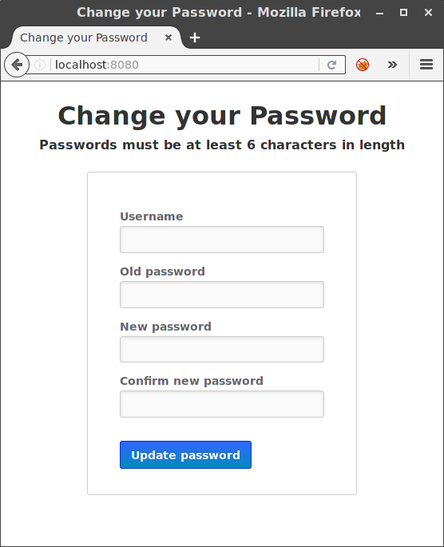

= ACS Password change
James Farr<https://github.com/nertwork[@nertwork]>
:page-layout: base
ifdef::env-github[:idprefix: user-content-]
:source-language: python
:language: {source-language}
:idseparator: -
//custom

This project is a simple implementation to change a users password on the CiscoACS server, it is built using python2 and will give you a neat and simple web form for your users to change their passwords. 

I've only tested this with ACS 5.6 and python 2.7 but it may work with other version of the ACS and python2.

It’s built with http://bottlepy.org[Bottle], a WSGI micro web-framework for Python.
It’s built with https://github.com/kiorky/SOAPpy[SOAPpy], a Simple to use SOAP library for Python.


=== Requirements

* Python 2.7
* https://pypi.python.org/pypi/bottle/[bottle]
* https://pypi.python.org/pypi/SOAPpy/[SOAPpy]
* https://pypi.python.org/pypi/PyXML/0.8.4[PyXml]
* https://pypi.python.org/pypi/fpconst[fpconst]

You must also enable the UCP service: 
```
acs config-web-interface ucp enable
```

Or you can use this guide: http://www.cisco.com/c/en/us/td/docs/net_mgmt/cisco_secure_access_control_system/5-1/sdk/sdkguide/ucp.html[EnablingUCP]


== Installation

Clone this repository and install dependencies:

[source, sh]
----
git clone git@github.com:nertwork/change-acs-password.git
cd change-password
pip install -r requirements.txt
----


== Configuration

Configuration is read from the file link:settings.ini[].
You may change location of the settings file using the environment variable `CONF_FILE`.


== Run it

There are multiple ways how to run it:

* with the built-in default WSGI server based on https://docs.python.org/3/library/wsgiref.html#module-wsgiref.simple_server[wsgiref],
* under a {wikip}/Web_Server_Gateway_Interface[WSGI] server like https://uwsgi-docs.readthedocs.org[uWSGI], http://gunicorn.org[Gunicorn], {pypi}/mod_wsgi[mod_wsgi], … (recommended)
* as a {wikip}/Common_Gateway_Interface[CGI] script.

=== Run with the built-in server

Simply execute the `acs-cp.py`:

[source]
python acs-cp.py

Then you can access the app on http://localhost:8080.
The port and host may be changed in link:settings.ini[].

=== Run with uWSGI and nginx

If you have many micro-apps like this, or you just want to have a simpler NGINX configuration you would want to use uWSGI and nginx.
It’s not so well known, but uWSGI allows to “mount” multiple application in a single uWSGI process and with a single socket.

[source, ini]
.Sample uWSGI configuration:
----
[uwsgi]
plugins = python34
socket = /run/uwsgi/main.sock
chdir = /var/www/scripts
logger = file:/var/log/uwsgi/main.log
processes = 1
threads = 2
# map URI paths to applications
mount = /admin/change-password=change-password/acs-cp.py
#mount = /admin/change-world=change-world/acs-cp.py
manage-script-name = true
----

[source, nginx]
.Sample nginx configuration as a reverse proxy in front of uWSGI:
----
server {
    listen 443 ssl;
    server_name example.org;

    ssl_certificate     /etc/ssl/nginx/nginx.crt;
    ssl_certificate_key /etc/ssl/nginx/nginx.key;

    # uWSGI scripts
    location /admin/ {
        uwsgi_pass  unix:/run/uwsgi/main.sock;
        include     uwsgi_params;
    }
}
----

== Screenshot



== Thanks

A special thanks to this project on LDAP password changes for the inspiration https://github.com/jirutka/change-password[jirutka/change-password]!


== Contributing

. Fork it.
. Create your feature branch (`git checkout -b my-new-feature`).
. Commit your changes (`git commit -am 'Add some feature'`).
. Push to the branch (`git push origin my-new-feature`).
. Create a new Pull Request.


== License

This project is licensed under http://opensource.org/licenses/MIT/[MIT License].
For the full text of the license, see the link:LICENSE[LICENSE] file.
